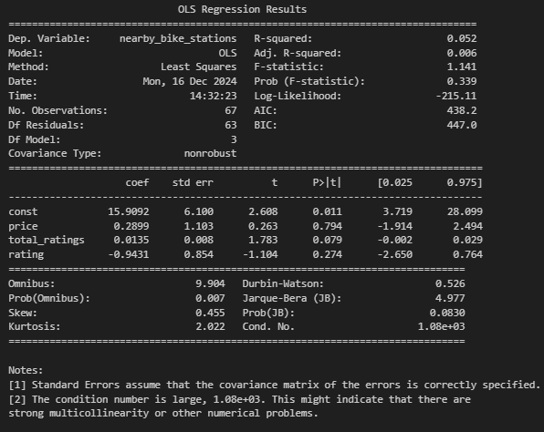
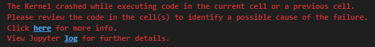

# Final-Project-Statistical-Modelling-with-Python

## Project/Goals
My project will attempt to pull the information from the CityBikes API and compare it against data pulled from the FourSquare and Yelp APIs and see if there is any relevant data from the nearby category of Bars that are influenced by the bike stations nearby in a 1km radius.

## Process
### Step 1
Creating a Dataframe pulled from the API of CityBikes to list all the bike stations. In order to reduce the possibility of overblowing my API calls, I specifically chose a city that had a lesser amount of bike stations, in this case, Salt Lake City, which only contained 59 stations.
### Step 2
Taking the latitude and longitude of each of the bike stations, pull the info of the nearest bars (up to 50 since that is the max limit of returnable results) from both the Yelp and FSQ APis.
### Step 3
Convert the generated dataframes from Step 2 into a SQLite database.
### Step 4
Take the dataframes and attempt to parse information from the regression models that are generated from the dataframes.

## Results
The APIs from Yelp and FSQ had generally the same information, however Yelp's API clearly had a larger focus on providing customer-friendly specific information, such as a larger return on rating information, which FSQ lacked. It wasn't completely missing from FSQ, but the pool of data that was useable for my models was substantially lower from FSQ once I cleaned the data generated from both APIs.

In the end I decided to focus on the correlation between the number of nearby bike stations, and any effect it had on the rating, amount of ratings, and price categorization of the bars in the dataframes.

The end results of the models show that while there is minor correlation between the data, I believe we can reject that the idea that the count of nearby bike stations have any influence on any of the analyzed variables.

Yelp:

FSQ:

## Challenges 
There was plenty! Trying to figure out the ins and outs of how the different APIs expect you to structure your calls, and also working within the daily limits of the Yelp API specifically. I managed to mitigate the last point mostly by making sure to test my data on a low number of results first. But like I stated above, the choice to use Salt Lake City and it's number of 59 stations was an intentional choice so that when it came time to use the entire bike station dataframe, it wouldn't stop halfway through because I maxed out my limit. And even with the small station count, I came very close to that problem, but managed to get it right on the first time I had to apply my call to the entire dataframe.

Other problems I ran into was the way that each API layered it's results into a series of data within singular dataframe cells. For FSQ, the way it was structured, I was able to use the .explode() function to be able to expand the results of a singular bike station. I hadn't learned of this function prior to this project, but it came in handy for this particular instance. However, for reasons I don't understand, when I attempted to apply the same logic to the results of the Yelp API, it crashed the whole kernel!

Unsure of how else to parse the data, with the suggestion and help of AI I instead had to apply an append function to the results, to mostly get the same end result as I was getting from the FSQ API code.

## Future Goals
If I had more time, perhaps I would intend to focus on only returned API results that had full data in the categories I was narrowing down with, instead of having to veto the parts that lacked information, resulting in a smaller sample size. Also further analyzing how it'd be possible to turn this data into a classification model, as admittedly at the time of this writing, creating models isn't my strong suit since it's relatively new concepts to me.
