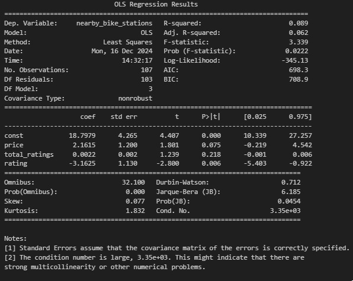

# Final-Project-Statistical-Modelling-with-Python

## Project/Goals
My project will attempt to pull the information from the CityBikes API and compare it against data pulled from the FourSquare and Yelp APIs and see if there is any relevant data from the nearby category of Bars that are influenced by the bike stations nearby in a 1km radius.

## Process
### Step 1
Creating a Dataframe pulled from the API of CityBikes to list all the bike stations. In order to reduce the possibility of overblowing my API calls, I specifically chose a city that had a lesser amount of bike stations, in this case, Salt Lake City, which only contained 59 stations.
### Step 2
Taking the latitude and longitude of each of the bike stations, pull the info of the nearest bars (up to 50 since that is the max limit of returnable results) from both the Yelp and FSQ APis.
### Step 3
Convert the generated dataframes from Step 2 into a SQLite database.
### Step 4
Take the dataframes and attempt to parse information from the regression models that are generated from the dataframes.

## Results
The APIs from Yelp and FSQ had generally the same information, however Yelp's API clearly had a larger focus on providing customer-friendly specific information, such as a larger return on rating information, which FSQ lacked. It wasn't completely missing from FSQ, but the pool of data that was useable for my models was substantially lower from FSQ once I cleaned the data generated from both APIs.

In the end I decided to focus on the correlation between the number of nearby bike stations, and any effect it had on the rating, amount of ratings, and price categorization of the bars in the dataframes.

The end results of the models show that while there is minor correlation between the data, I believe we can reject that the idea that the count of nearby bike stations have any influence on any of the anaylzed variables.

Yelp:

## Challenges 
(discuss challenges you faced in the project)

## Future Goals
(what would you do if you had more time?)
